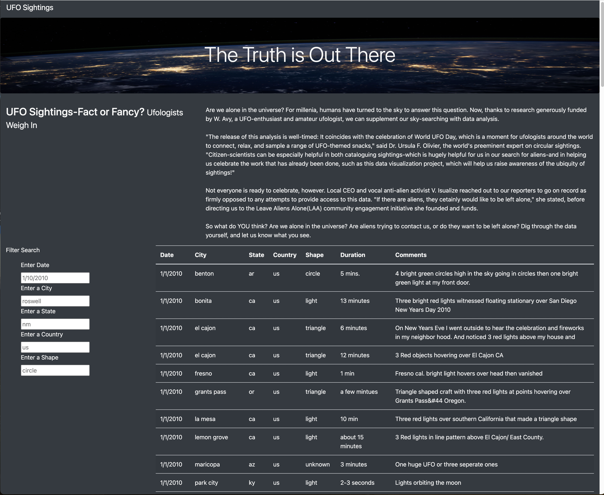
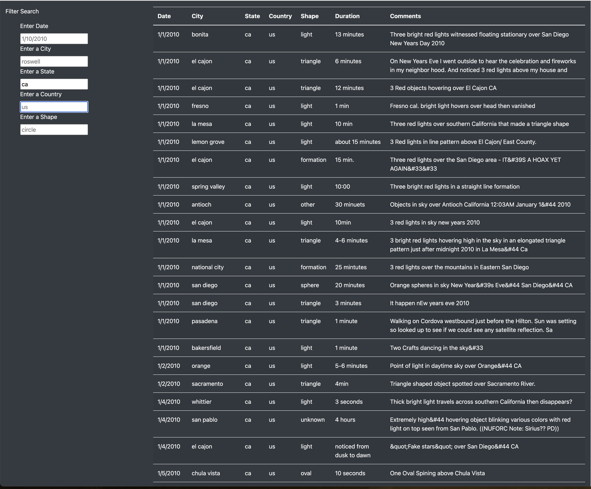
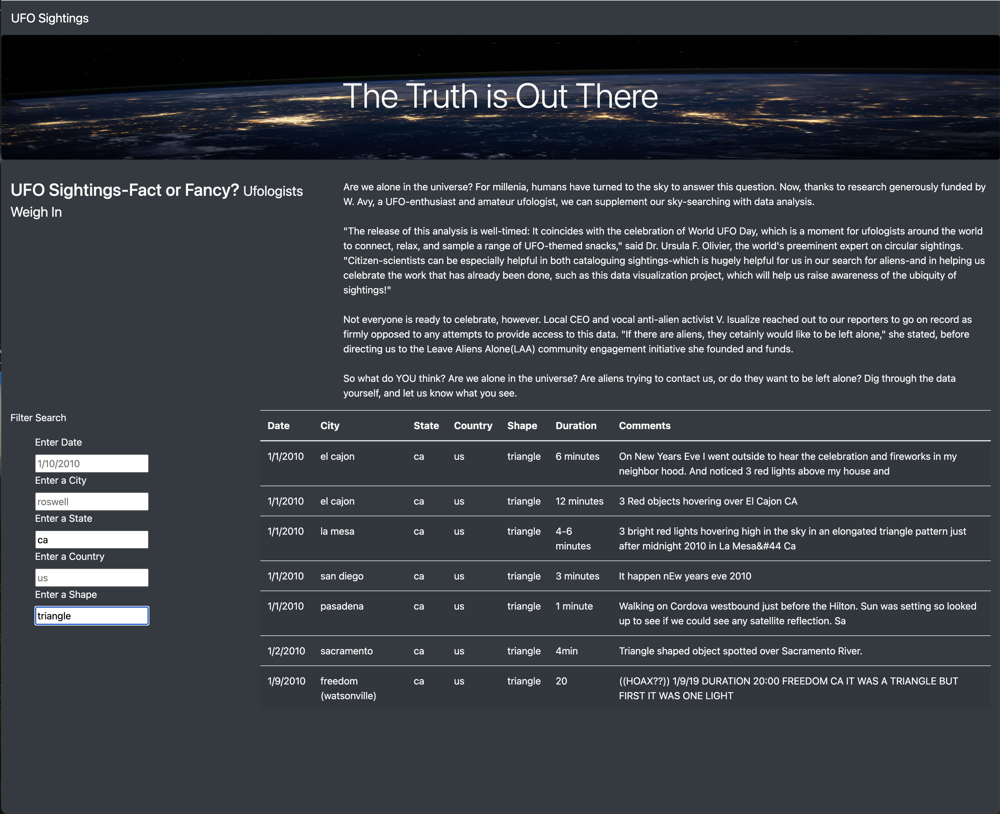
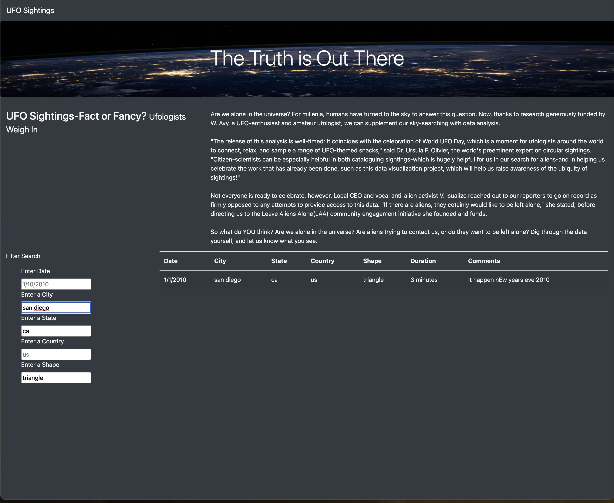
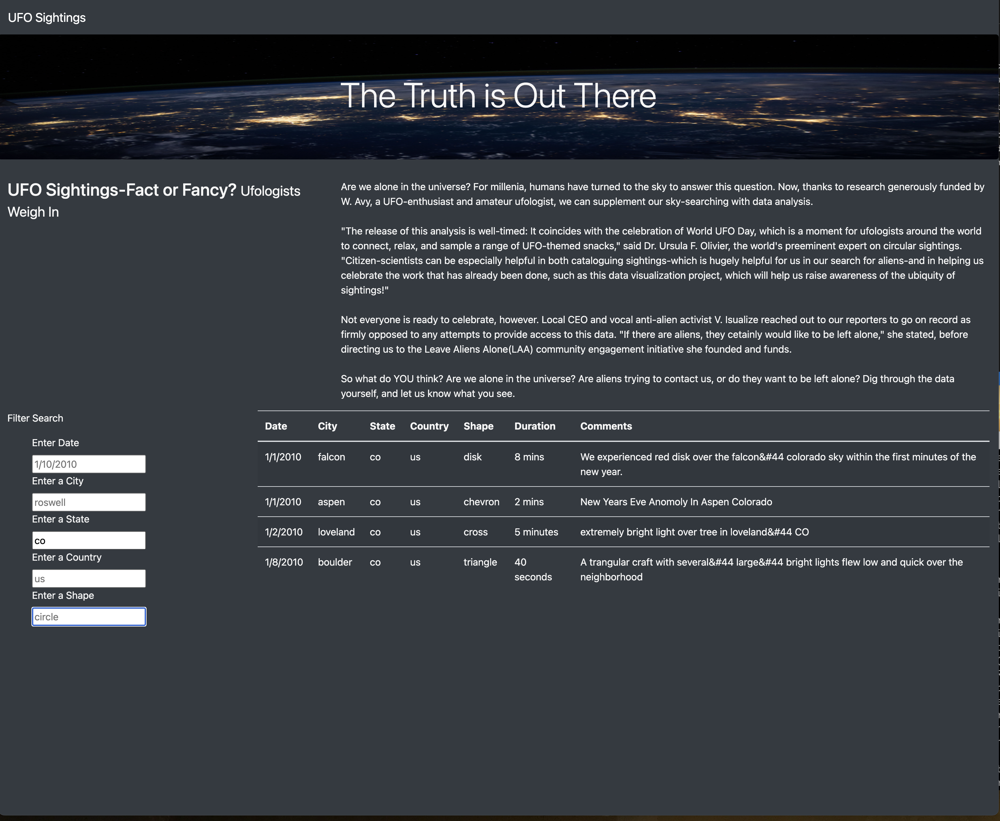

# UFOs Project

## Overview of Project:  
The purpose of this project was to help create a website for a client to share an article on UFOs  
and data on UFO sightings. The client wanted her website to be interactive for users by creating a 
table of the UFO sighting data that users could filter by certain criteria, to make it easier for users 
to sift through the data or choose what items they are specifically interested in seeing. In order  
to achieve what was requested by the client, we used data provided in a javascript file, code that 
was written in javascript to create the table and the search function, and an html file to create  
the website that called the javascript code to show the UFO Sightings table and make it interactive. 
We also used Bootstrap for the CSS framework.

## Results: 
A user can interact with client's website by entering different criteria in one or multiple search 
boxes found on the lower left-hand side of her website. The different search options are "Date",  
"City", "State", "Country", and "Shape." In each search box an example of what can be entered is  
found within the box, for example, in the box under "Enter Date" a user can enter a date in the 
following format, M/DD/YYYY. A user will start by choosing which search box they want to filter 
the data by. Once the website detects a change in the search box, after the data is entered and   
either a button or mouse click occurs, it will automatically filter the table to only show the  
specific criteria that was entered into the box. Once one box is filled in, another one can be 
selected and have information entered in, and once again, with a button or mouse click, will 
update the table to show the new filter along with the old one. Then if a user wants to start all 
over, all they have to do is hit the refresh button and then all the criteria entered will be 
cleared and the table will default to showing all the data in the starting table. Below are examples 
showing the search boxes in action. (Note:the search boxes are sensitive and need to have data entered 
specifically as shown in the examples)

**Website with No Search Criteria Entered**

**Website with One Search Criteria Entered Under "State"**

**Website with Two Search Criteria Entered: "State" and "Shape"**

**Website with Three Search Criteria Entered: "State", "Shape", and "City"**

**Website Cleared with New Search Criteria for Different State**

## Summary: 
One drawback for this new design is that the data entered into the search boxes needs to be entered exactly 
as the examples found in the boxes. If the date is entered as MM/DD/YYYY instead of M/DD/YYYY or any of the 
other boxes are entered with capital letters instead of strictly lowercase, the search will render no results 
even if results do exist for the criteria entered. Two recommendations for further development are: add a pop-up 
dialog box that informs users they entered the criteria incorrectly and to inform them how to enter search criteria  
in the search boxes, and to adjust where needed in the source code to make it so the search boxes aren't so  
particular to specific formatting.